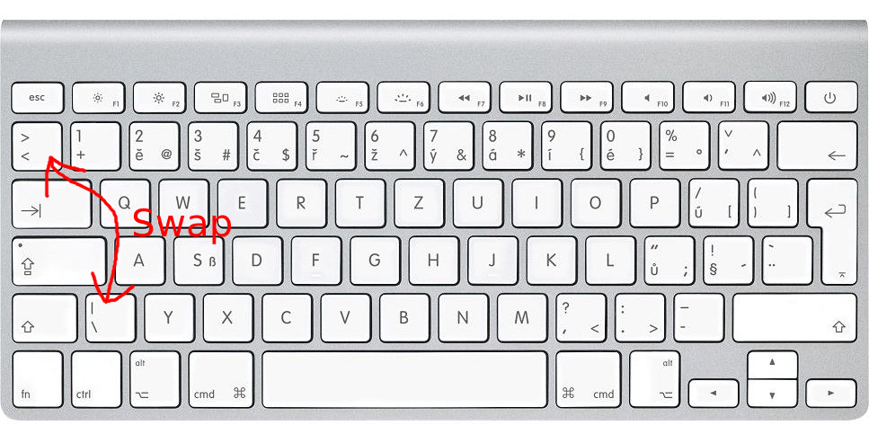

# cz-to-eng-keyboard-layout

# TLDR

# Description

This repo provides a keyboard layout that moves the ` and ~ key to the numeric row.
The ± and § key gets moved next to shift.

**Warning** when changing back to a keyboard with US layout, you need to change your input source,
as the keys were remapped.

# Installation

Just double-click the bundle & install for the current user.
The new keyboard layout can be found under English layouts called `en-cz-swap`.
Enjoy.

### TODO
- fix icon not showing up properly